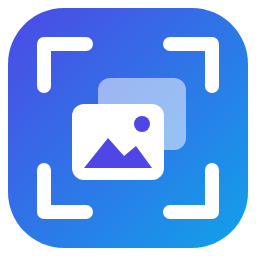
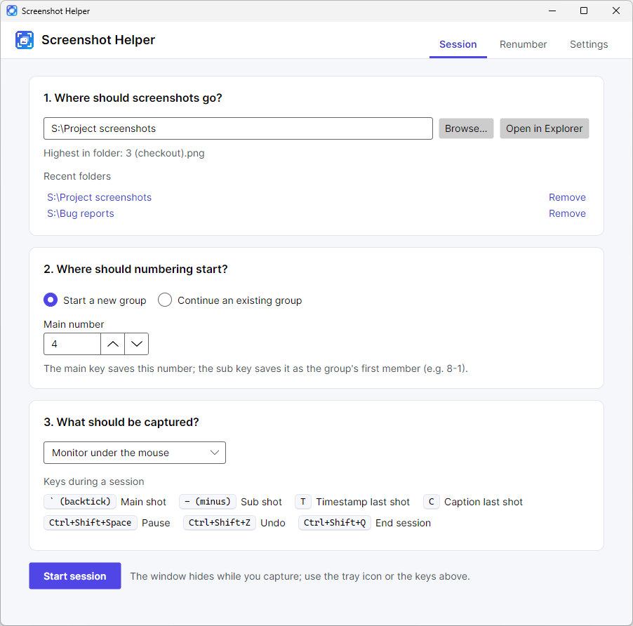
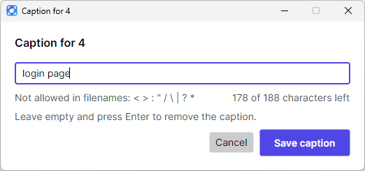
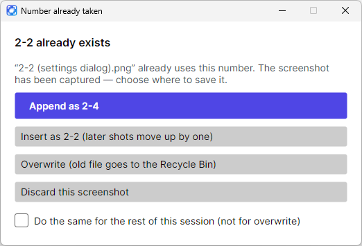
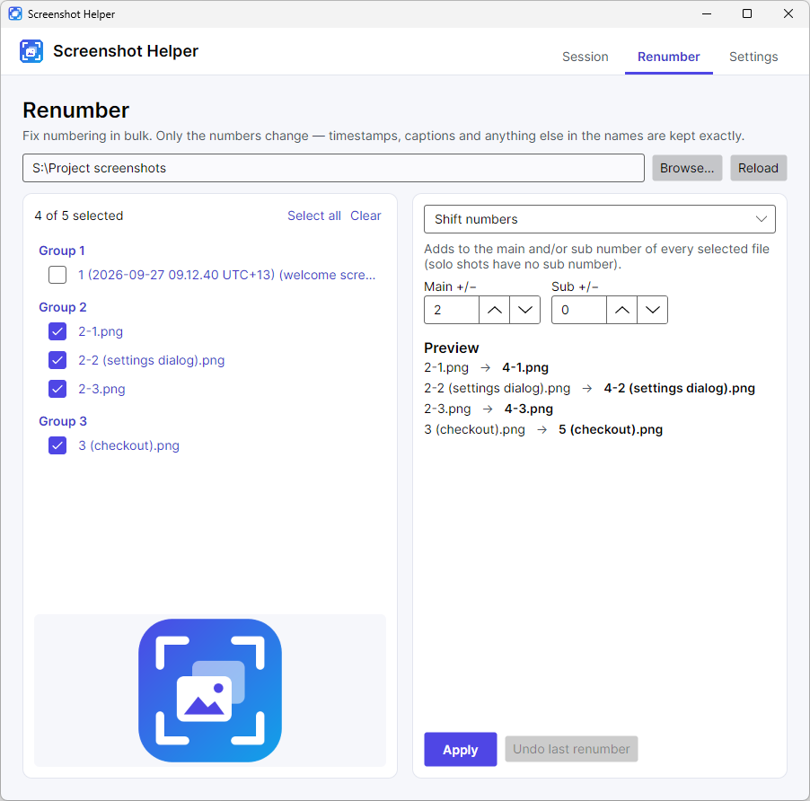

<p align="center">
  
</p>

<h1 align="center">Screenshot Helper</h1>

<p align="center">
  <a href="https://github.com/mkim87404/screenshot-helper/actions/workflows/ci.yml"></a>
  <a href="https://github.com/mkim87404/screenshot-helper/releases/latest"></a>
  
  
  
  <a href="LICENSE"></a>
</p>

<p align="center"><b>Keyboard-driven screenshots for Windows that number and group themselves — <code>1</code>, <code>2-1</code>, <code>2-2</code>, <code>3</code> — with optional timestamps and captions.</b></p>

<p align="center">
  <picture>
    <source media="(prefers-color-scheme: dark)" srcset=".github/media/home-dark.png" />
    
  </picture>
</p>

## 📑 Contents

- [Overview](#-overview)
- [Features](#-features)
- [Download and run](#-download-and-run)
- [How to use](#-how-to-use)
- [Settings](#%EF%B8%8F-settings)
- [Build from source](#-build-from-source)
- [Project structure](#-project-structure)
- [Design notes](#-design-notes)
- [Known limitations](#-known-limitations)
- [Roadmap](#-roadmap)
- [Contributing](#-contributing)
- [License](#-license)

## 🧭 Overview

Documenting a bug, a setup process or a test run usually means dozens of screenshots that you then rename by hand. Screenshot Helper
sits in the tray and gives you two keys instead:

- **Main** (`` ` ``) starts a new *group*: `4.png`
- **Sub** (`-`) adds to the current group: `4-2.png`, `4-3.png` — and the group's first shot is renamed `4-1.png` automatically

Files sort into the order you took them, related shots stay together, and nothing else about your workflow changes: the keys work
in any app, the shots land in the folder you chose, and when you finish, Explorer opens with exactly this session's files selected.

## ✨ Features

- **Automatic numbering and grouping** — main and sub keys, starting from the next free number or any number you choose, with a live check against what's already in the folder.
- **Timestamps and captions** — capture first, label after: `t` stamps the shot you just took with the time it was captured (local time with UTC offset, or UTC) and `c` opens a caption box for it that won't accept more characters than fit in a valid Windows path. Prefer to set them up before capturing? One setting switches both keys to "next shot". Either way, the timestamp is always the moment the shot was taken, however often you toggle it.
  <br/>`5-2 (2026-09-27 10.05.33 UTC+13) (login page).png`
- **Never loses or overwrites data** — every file is written to a temp file and renamed atomically without overwriting; renames only ever change the numbers, never the rest of the name; "overwrite" and "undo" use the Recycle Bin.
- **Collision handling** — a taken main number is skipped automatically; a taken sub number asks whether to append, insert (shifting later shots), overwrite or discard — the shot is already captured, so the prompt is never in it.
- **Renumber tool** — shift, close gaps, move to another group or tidy up solo shots across any selection, with a preview, a crash-safe journal and one-click undo.
- **Undo last shot**, **pause** (so you can type normally), and a **tray icon** that shows the session state.
- **Sound and on-screen feedback** for every action — the notification is excluded from screen capture, so it never shows up in your screenshots.
- **Choose what to capture** — monitor under the mouse, primary monitor, all monitors or the active window (with clean, transparent rounded corners); optionally copy each shot to the clipboard too.
- **Rebindable keys**, light/dark theme, and settings that are saved instantly.

| Caption box | Collision prompt | Renumber |
| --- | --- | --- |
|  |  |  |

## 📥 Download and run

1. Download `ScreenshotHelper-<version>-win-x64.exe` (or `win-arm64` for ARM devices) from the [latest release](https://github.com/mkim87404/screenshot-helper/releases/latest).
   A portable `.zip` with the same exe is also available.
2. Run it — there's nothing to install and no .NET runtime needed. Settings are stored in `%APPDATA%\ScreenshotHelper`.

**To update**, exit the app (tray icon → Exit), download the new release and replace the old exe with it. Your settings, keys and recent
folders live in `%APPDATA%\ScreenshotHelper`, so they carry over.

> **Windows SmartScreen:** the app isn't code-signed, so the first launch may show *"Windows protected your PC"*.
> Choose **More info → Run anyway**. You can verify a download first:
> ```powershell
> Get-FileHash .\ScreenshotHelper-1.0.0-win-x64.exe -Algorithm SHA256   # compare with SHA256SUMS.txt in the release
> gh attestation verify .\ScreenshotHelper-1.0.0-win-x64.exe -R mkim87404/screenshot-helper   # proves it was built by this repo's CI
> ```

**Requirements:** Windows 10 version 2004 or later, or Windows 11 (x64 or ARM64).

## 🚀 How to use

1. **Choose a folder** on the **Session** tab. The app shows the highest numbered screenshot already there.
2. **Choose where numbering starts** — *Start a new group* (next free number by default) or *Continue an existing group*.
3. **Start session.** The window hides; use the keys below anywhere.
4. **End the session** (`Ctrl+Shift+Q`). Explorer opens with this session's screenshots selected, and the app shows a summary.

| Key | Action |
| --- | --- |
| `` ` `` | Main shot — starts a new group (`4`) |
| `-` | Sub shot — adds to the group (`4-1`, `4-2`, …) |
| `t` | Add the capture time to the shot just taken (press again to remove it) |
| `c` | Caption the shot just taken (edit or clear an existing caption) |
| `Ctrl+Shift+Space` | Pause / resume — while paused, the keys above type normally |
| `Ctrl+Shift+Z` | Undo the last shot (it goes to the Recycle Bin) |
| `Ctrl+Shift+Q` | End the session |

During a session these keys belong to Screenshot Helper and are not passed on to the app you're capturing, and holding a key down
takes exactly one shot. Only the main and sub keys ever take a screenshot. All keys can be changed in Settings, where `t` and `c`
can also be switched to apply to the *next* shot instead.

**File names** follow `{number} ({timestamp}) ({caption}).png` — the timestamp and caption are each optional:

```
1.png                                                 a solo shot
2-1.png  2-2.png  2-3 (settings dialog).png          a group of three
3-1 (2026-09-27 10.05.33 UTC+13) (checkout).png      timestamp and caption
```

**Renumber** fixes numbering afterwards: select files (or whole groups), pick an operation, check the preview, apply. Only the numbers
change, so timestamps, captions and anything else you added to a name are always kept.

## ⚙️ Settings

| Setting | Default |
| --- | --- |
| Keys | as above (restore defaults at any time) |
| Timestamp and caption keys apply to | The screenshot just taken |
| Always add a timestamp | Off |
| Timestamp time | Local time (with UTC offset) |
| Number the first shot of every group `M-1` | Off (a lone shot stays `M` until the group grows) |
| When a sub number is taken | Ask each time |
| Default capture | Monitor under the mouse |
| Also copy to the clipboard | Off |
| Open the folder when a session ends / Exit the app | On / Off |
| Sounds, volume, per-event sounds, on-screen notifications and their corner | On, 70 %, all on, bottom right |
| Theme | Match Windows |

The window remembers its last size (not its position, so it always opens centred and on-screen).

## 🛠 Build from source

Requirements: [.NET 10 SDK](https://dotnet.microsoft.com/download/dotnet/10.0) (version pinned in `global.json`) and PowerShell 7.

```powershell
git clone https://github.com/mkim87404/screenshot-helper.git
cd screenshot-helper
pwsh build/Build.ps1                              # restore, build and run all tests
dotnet run --project src/ScreenshotHelper.App     # run the app
pwsh build/Publish.ps1                            # single-file exes + zips + checksums in artifacts/
```

Set `SCREENSHOTHELPER_HOME` to a folder to keep settings, logs and journals there instead of your profile (handy for testing).

**Tests** are integration-first: the core runs against real temporary folders (including randomised property tests of the
renumber planner and simulated crash recovery), the Windows layer calls the real Win32 APIs, and the UI is driven headlessly with
[Avalonia.Headless](https://docs.avaloniaui.net/docs/concepts/headless/). CI runs the full suite on Windows and the core suite on Linux.

A few Windows tests are tagged `Category=Disruptive`: they briefly show backdrop windows behind the foreground window, or replace the
clipboard and then restore it. They run with everything else, locally and in CI, and leave the machine as they found it — just keep
your hands off the keyboard and mouse while the suite runs. To run the rest on their own:
`dotnet test tests/ScreenshotHelper.Platform.Windows.Tests --filter "Category!=Disruptive"`.

## 🗂 Project structure

```
src/
  ScreenshotHelper.Core/               OS-independent logic (net10.0): filename grammar, session engine and actor,
                                       collision policy, renumber planner + journal, settings, sound synthesis
  ScreenshotHelper.Platform.Windows/   Win32 services: RegisterHotKey, GDI capture, Recycle Bin, Explorer reveal,
                                       clipboard, sound playback, focus and capture-exclusion, single instance
  ScreenshotHelper.App/                Avalonia 12 MVVM app: views, view-models, tray, toast, session coordinator
tests/                                 One test project per source project (xUnit v3)
build/                                 PowerShell build and publish scripts (used by CI)
tools/                                 Icon generator, window capture and README screenshot scripts — see tools/README.md
docs/SPEC.md                           Functional specification (current behaviour)
docs/DECISIONS.md                      Decision log: decisions, findings and trade-offs, newest first
.github/workflows/                     CI and tag-triggered releases
```

## 🧠 Design notes

- **Exclusive hotkeys, not a keyboard hook.** `RegisterHotKey` only delivers the app's own chords, can't be silently dropped by
  Windows the way a slow low-level hook can, and keeps keys from leaking into the app being captured.
- **One actor owns the session.** Hotkeys enqueue commands into a channel with a single consumer, so rapid presses are processed in
  order and no state is shared between threads.
- **Clean window captures.** Windows 11 windows have rounded corners and a translucent border, so a plain capture bakes in whatever
  was behind them. Active-window shots are taken over a white and then a black backdrop placed directly behind the window, and the
  edge's true transparency is recovered from the difference.
- **Crash-safe files.** Shots are written to a hidden temp file, flushed, then renamed with no-overwrite; bulk renames are recorded
  in a write-ahead journal so an interrupted run can be finished or rolled back on the next start.
- **Portable core.** Everything except the Win32 layer and the UI targets plain `net10.0` and is tested on Linux, so porting means
  writing one new platform project.

The behaviour is specified in [docs/SPEC.md](docs/SPEC.md); the reasoning behind each decision is in [docs/DECISIONS.md](docs/DECISIONS.md).

## ⚠️ Known limitations

- **Windows only** for now (see the roadmap).
- **HDR displays:** GDI capture produces a standard-range image, which can look washed out when HDR is on.
- **Protected content** (e.g. DRM video) and the secure desktop (UAC prompts, lock screen) capture as black or not at all — a Windows restriction.
- **Path length:** captions are limited so the full path stays within 260 characters, even if long paths are enabled, because Explorer and many apps don't support longer ones.
- **Unsigned builds** trigger a SmartScreen warning on first run.

## 🗺 Roadmap

- macOS and Linux (X11) ports via new platform projects
- JPEG/WebP output, region capture, delay timer
- Portable mode (settings next to the exe) and start with Windows
- winget and Scoop packages

## 🤝 Contributing

Issues and pull requests are welcome. Please run `pwsh build/Build.ps1` before submitting — CI runs the same script — and keep new
behaviour covered by tests.

## 📄 License

[MIT](LICENSE)
